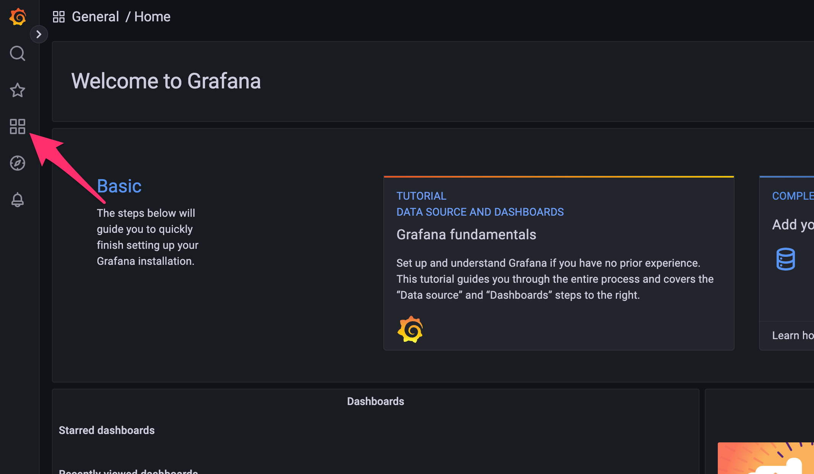
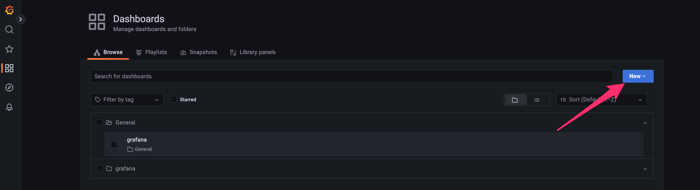
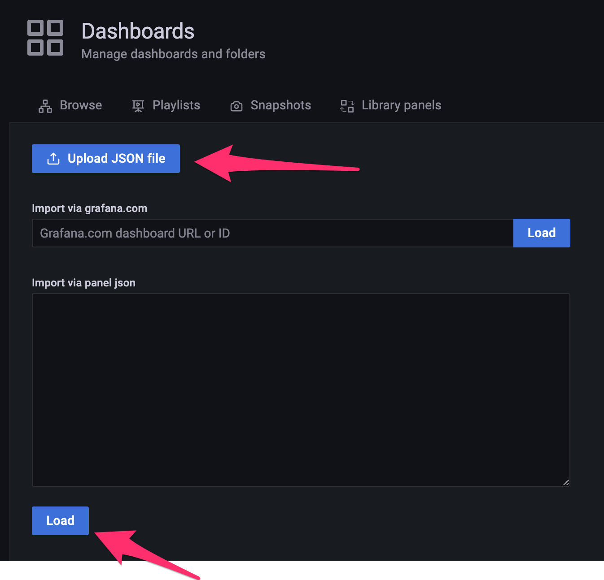
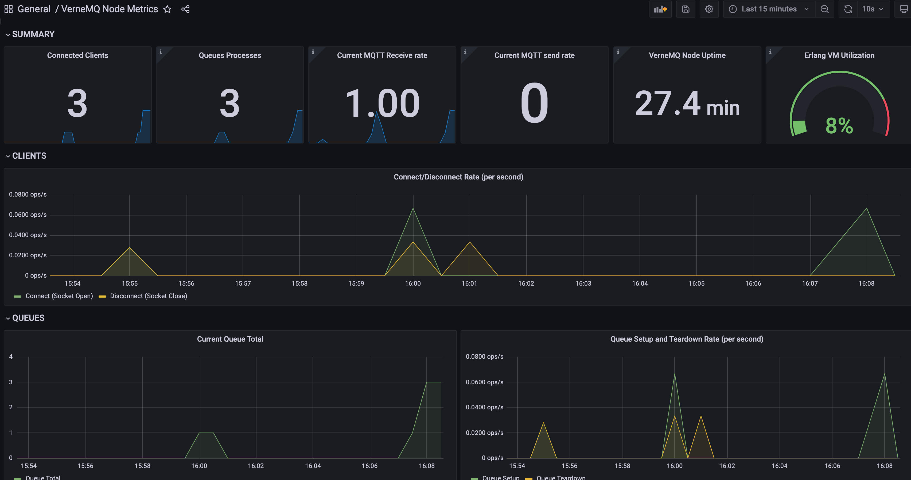
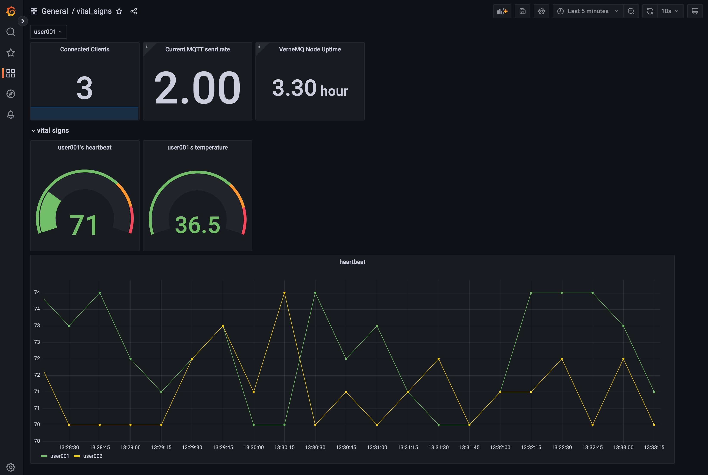

# RDBOXと箱庭を使ったIoT試験

## MQTT検証

### RDBOXをインストールする

KinD版：[rdbox\-intec/rdbox at insiders](https://github.com/rdbox-intec/rdbox/tree/insiders)

- MQTTのポート番号を任意に設定したい場合は`confs/modules/kind/kind/v1beta1/values.yaml`の`extraPortMappings`を設定する．

  ```yaml
  extraPortMappings:
  - containerPort: 32022
    hostPort: 32022
    protocol: TCP
  ```

### ブローカーのインストール

ブローカーとして，[VerneMQ](https://vernemq.com/)を採用した．

```bash
helm repo add vernemq https://vernemq.github.io/docker-vernemq
helm repo update
helm -n vernemq upgrade --install vernemq vernemq/vernemq --create-namespace -f values.yaml
kubectl -n vernemq apply -f ingress.yaml
```

### Publisher/Subscriber

Python用クライアントとして[Eclipse Paho \| The Eclipse Foundation](https://www.eclipse.org/paho/)を使った．

```bash
python3 -m venv .venv
source .venv/bin/activate
pip3 install paho-mqtt
# connectの接続先ホスト・ポートは適宜変更すること
python3 pub.py
python3 sub.py
```

### Grafanaでの視覚化

- RDBOXのCLI指示に合わせてWebブラウザでGrafanaページにアクセス
  - [https://grafana.rdbox.192-168-10-155.nip.io/dashboards](https://grafana.rdbox.192-168-10-155.nip.io/dashboards)


#### ブローカーステイタス

dashboard.jsonを読み込ませる

- ダッシュボード画面へ

- New -> Import

- dashboard.jsonを読み込ませる

- Dashboarを見る


- 取得元：[vernemq/VerneMQ Node Metrics\.json at master · vernemq/vernemq](https://github.com/vernemq/vernemq/blob/master/metrics_scripts/grafana/VerneMQ%20Node%20Metrics.json)
- なお，一部不具合を修正（完全には直っていない模様．．．）

#### センサーデータ

上記のMQTTブローカのデータ＋実際のセンサー値（今回はバイタルデータ）を組み合わせたダッシュボードを表示．

以下のコマンドの実行で，MQTTの特定のトピック（v1/devices/me/+）からのデータを，Prometheusに変換・保存する仕組みが動き出します．モジュールとして「[hikhvar/mqtt2prometheus: MQTT to Prometheus gateway](https://github.com/hikhvar/mqtt2prometheus)」を使用します．（configmap.yaml等のIPアドレスやポート番号を適宜変更すること．）

```bash
helm -n mqtt2prometheus upgrade --install  mqtt2prometheus ./helm/mqtt2prometheus --create-namespace
```

前述の「ブローカーステイタス」の章と同様の手順で，ダッシュボードを追加します．ここではファイル名`vital_signs.json`のダッシュボード定義を使います．



左上部のセレクトボックスを切り替えることで異なるセンサーからの「バイタルデータ`Gauge`」を表示することも可能です．

### 片付け

```bash
# まずは，Pub/Subを止める

# その後に．．．
helm uninstall -n mqtt2prometheus mqtt2prometheus
helm uninstall -n vernemq vernemq
```

## TODO

- [ ] MQTT
  - [x] ブローカーの動作確認
  - [x] ブローカーの可視化
  - [x] センサーデータ可視化
  - [ ] MQTT over TLS
  - [ ] ユーザ認証
- [ ] パケットの制御
  - [ ] Istioのセットアップ
  - [ ] Istioの可視化
  - [ ] パケットロスの発生
